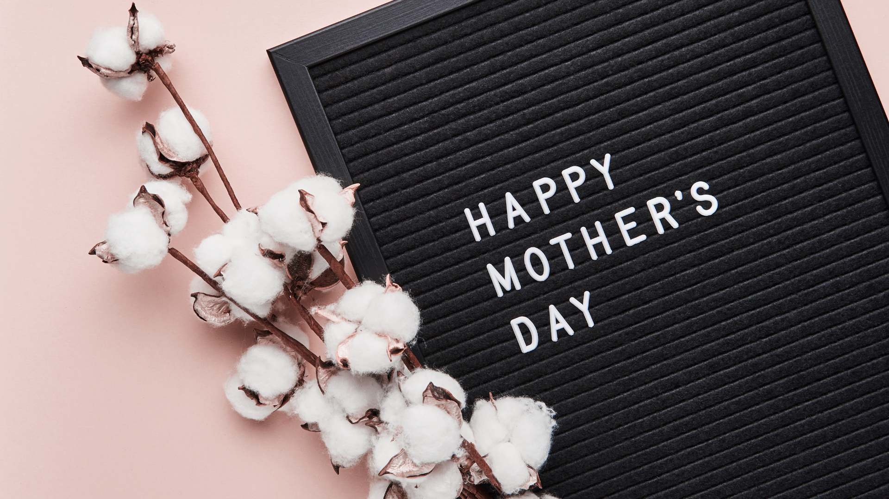

### Geschenke vom Herzen für deine Mama

**Am 09. Mai ist Muttertag!** Ein wundervoller Anlass, um geliebten Menschen eine Freude machen. Das Schönste am Schenken ist für mich meinen Liebsten _Danke_ zu sagen, für alles was sie sind und jeden Tag leisten. In unserer materialisierten Konsumgesellschaft geht es mir vor allem darum ein Geschenk zu machen, welches von Herzen kommt und nachhaltig, sinnvoll und mit besonderer Bedeutung ist. **_Bist du bereit tiefsinnige, bedeutsame Geschenke zu machen, die deiner Mama dauerhaft ein Lächeln ins Gesicht zaubern?_** Ja? Fantastisch! Damit dir das Geschenke-Brainstorming einfach und schnell gelingt, habe ich für dich in diesem Blog-Beitrag meine **Top 10 Geschenkideen für den Muttertag** zusammengestellt.

**Ein Hoch auf alle Mutterfiguren**

Wir wollen an diesem Tag allen Arten von Müttern einmal DANKE sagen - inklusive der frischgebackenen Mamas, der Stiefmütter, der Großmütter, der Haustier- und Pflanzenmamas und all jene, die eine Extraportion Aufmerksamkeit verdient haben ♥ Deswegen habe ich hier wundervolle Geschenkideen zusammengestellt, über die sich garantiert auch Menschen freuen, die schon alles haben.

#### Außergewöhnliche Menschen verdienen außergewöhnliche Geschenke

Die letzten Monate haben uns und unsere familiären Beziehungen sehr gefordert - Zeit, ein Lächeln zu verschenken! Wenn du deiner Mama etwas ganz besonderes schenken willst, habe ich für dich meine **Top 10 Geschenke Tipps** zusammengestellt, die von Herzen kommen auch auch **spirituell Interessierte**, **nachhaltig orientierte Mamas** sowie **Yoga-Fans** erstrahlen lassen werden.

Damit deine spirituellen Geschenke auch **Last-Minute** ankommen, habe ich bei der Auswahl darauf geachtet, dass es kurze Lieferzeiten sind - viel Freude beim Aussuchen, Vorfreuen und Verschenken!

## Die 10 besten Geschenke Tipps zum Muttertag

Was schenken wir den besonderen Menschen in unserem Leben, die alles haben, die nichts brauchen? Es soll ein außergewöhnliches Geschenk sein, etwas, dass ihr Herz zum strahlen bringt - und am besten **nachhaltig**, **mit Liebe** und für die Last-Minute-Geschenk Sucher **schnell lieferbar** sein. Keine Sorge: I got you ♥ mit den 10 besten Tipps für spirituelle Geschenke für ein bewussteres, schöneres und erfülltes Leben. 

***

## **Tipp 1: Selbstliebe verschenken**

#### ↠ Bio Badepralienen im Geschenkset ↞

Muttertagsgeschenke wie diese kommen nie aus der Mode, doch besonders dieses Jahr verdienen es unsere Mütter sich zu entspannen! Mit diesem wundervollen Geschenkset in höchster Qualität verschenkst du eine Reise für die Sinne.

> **_Was macht dieses Geschenk besonders?_**
>
> _Bio Qualität, vergane Geschenk-Idee, hochwertige Geschenkbox mit Satinschleife_

**Hier geht es direkt zu den** <a href="https://amzn.to/2QP4TAs" target="_blank">**Bio Badepralinen Set in der Geschenkbox**</a>*.

<a href="https://www.amazon.de/Badepralinen-Geschenkset-Weihnachtsgeschenk-hochwertiger-Geschenk-Idee/dp/B01BPEA9PA?__mk_de_DE=%C3%85M%C3%85%C5%BD%C3%95%C3%91&crid=3PRAKVFHAENE6&dchild=1&keywords=muttertag+badeset&qid=1620051110&sprefix=muttertag+bade%2Caps%2C193&sr=8-2-spons&psc=1&spLa=ZW5jcnlwdGVkUXVhbGlmaWVyPUFUSkxGNjJZUVZVR0omZW5jcnlwdGVkSWQ9QTA3MzQ4MzMxRTRPNE0wTVA3QkRMJmVuY3J5cHRlZEFkSWQ9QTA0NTYwODQxUDRBUkg2MlBFVFpOJndpZGdldE5hbWU9c3BfYXRmJmFjdGlvbj1jbGlja1JlZGlyZWN0JmRvTm90TG9nQ2xpY2s9dHJ1ZQ%3D%3D&linkCode=li2&tag=innerlight06-21&linkId=2101ee5a16c5a311cfc1e7a204f5287a&language=de_DE&ref_=as_li_ss_il" target="_blank"></a>

***

#### ↠ Duftkerzen Aromatherapie ↞

Als passendes Geschenk dazu eignet sich dieses wunderschöne Kerzenset mit verschiedenen Düften für perfekte Entspannung. Das Kerzen-Geschenkset wird in einer tollen Box geliefert, sodass du das Geschenk auch direkt zu deiner Mama nach Hause schicken lassen kannst.

> **_Was macht dieses Geschenk besonders?_**
>
> _Aromatherapie Duftkerzenset mit sechs verschiedenen Düften,_ hergestellt aus Sojawachs und bleifreiem Baumwollkern, lange Brenndauer und wunderschönes Design

**Hier geht es direkt zum** <a href="https://amzn.to/3xHAgxj" target="_blank">**Duftkerzen-Geschenkset**</a>*.

***

## **Tipp 2: Wohnen & Leben**

#### ↠ Blume des Lebens-Windspiel ↞

Mit diesem faszinierenden Mobile, das in Bewegung gebracht, zauberhafte dreidimensionale Welten erschafft, zauberst du deiner Mama jeden Tag aufs Neue ein Lächeln ins Gesicht. Die Blume des Lebens ist ein uraltes kosmisches Symbol und erzeugt ein absolut harmonisches Schwingungsfeld.  Es energetisiert in Windeseile jeden Raum, indem es Stillstehendes aufwirbelt und wieder zum Fließen bringen. Magisch zieht es jeden Betrachter in Bann, verzaubert und bringt ihn zur inneren Mitte zurück.

> **_Was macht dieses Geschenk besonders?_**
>
> _Wunderschönes 3D-Windspiel aus Edelstahl für drinnen und draußen, zieht magisch jeden Betrachter in seinen Bann, verzaubert und bringt ihn zu seiner inneren Mitte zurück_

**Hier geht es direkt zum wunderschönen** <a href="https://amzn.to/3akwsZA" target="_blank">**Blume des Lebens-Windspiel**</a>*.

" target="_blank"> </a>

***

#### ↠ Heilendes Klangspiel von WOODSTOCK ↞

Ein weiteres wundervolles Geschenk für alle, die Klänge und Töne lieben - dieses Glockenspiel von WOODSTOCK ist nicht nur wunderschön anzusehen, sondern erzeugt eine einzigartig magische Stimmung, die so ungewöhnlich und tröstlich ist. Durch die Präzisionstastatur entsteht die Illusion von vielen mehr Noten als es Röhren gibt.

> **_Was macht dieses Geschenk besonders?_**
>
> _Optisch wunderschönes & tief heilsames Klangspiel für drinnen und draußen, von Meisterklingel-Handwerkern der Firma Woodstock gefertigt, in Woodstock Chimes-Box geliefert - perfekt zum Verschenken_

**Hier geht es direkt zum original** <a href="https://amzn.to/3gVc9VZ" target="_blank">**WOODSTOCK Klangspiel**</a>*.

***

## **Tipp 3: Schmuck**

#### ↠ Doppelherz-Kette ↞

Mit dieser Mutter-Tochter-Halskette tragt ihr jeden Tag eure einzigartige und tiefe Verbindung ganz nah bei eurem Herzen. Die Anhänger passen ineinander und sind aus hochwertigen Silber hergestellt. Absoluter Hingucker und ein großartiges Geschenk für euch beide!

> **_Was macht dieses Geschenk besonders?_**
>
> 100% echtes 925 Sterling Silber, entworfen und hergestellt von EUDORA, wunderschöne symbolische Bedeutung

**Hier geht es direkt zur wunderschönen** <a href="https://amzn.to/3ecdaao" target="_blank">**Mutter-Tochter-Halskette**</a>*.

***

## **Tipp 4: DIY**

#### ↠ DIY Holzschild ↞

Eine wunderschöne Möglichkeit deine Liebe zu deiner Mama zu verewigen. Mit diesem DIY Holzschild kannst du in 100 verschiedenen Designs deiner Mama zeigen, wie lieb zu sie hast und dich dabei auch noch kreativ verwirklichen. Mit nur 1-2 Stunden Bastelzeit kannst du das hochwertige Fichtenholz in das perfekte Geschenk zum Muttertag verwandeln!

> **_Was macht dieses Geschenk besonders?_**
>
> _hochwertige Geschenkverpackung, ideal für Anfänger geeignet, etwas Selbstgemachtes, grenzenlose Kreativität, individuell und personalisierbar_

**Hier gehts direkt zum** <a href="https://amzn.to/3nI4vzG" target="_blank">**DIY Holztafel-Geschenk**</a>*.

***

## **Tipp 5: Meditation & Yoga**

#### ↠ Meditationskissen mit Kapokfüllung ↞

Bei diesem Zafukissen mit Seidenstickerei und Kapokfüllung handelt es sich um ein absolut perfektes Geschenk für jeden - es ist nicht nur wunderschön anzusehen, sondern hat auch einen unglaublich großen Einsatzbereich drinnen und draußen, da die Kapokfaser keine Feuchtigkeit aufnimmt. Für alle Yogis ist dieses Kissen der neue Lieblingsbegleiter für Meditation und Yoga-Sessions.

> **_Was macht dieses Geschenk besonders?_**
>
> _Kissen werden in Thailand von Familienbetrieben in liebevoller Handarbeit gefertigt; farbenfroh und wunderschönes Design; mit reinem, unbehandeltem Kapok gefüllt; nachhaltiges Qualitätsprodukt mit geprüfter Qualität_

**Das wunderschöne Meditationskissen mit Kapokfüllung gibt es** [hier](https://amzn.to/379Rvwj "Meditationskissen")***.**

***

#### ↠ Yoga Matte ↞

Für alle Yoga-Anfänger und Sport-Liebhaber das perfekte Geschenk - eine wundervolle Yoga-Matte! Diese ist aus umweltfreundlichem Material, dick genug, um die Gelenke zu schützen und trotzdem leicht zu transportieren. In verschiedenen Farben und Designs erhältlich!

> **_Was macht dieses Geschenk besonders?_**
>
> _aus umweltfreundlichem Material, rutschfest, wunderschöne Farben und Designs, geeignet für Yoga, Pilates und Fitness-Übungen_

**Hier geht es direkt zur perfekten .**

<a href="https://amzn.to/3texbBB" target="_blank">**Yoga-Matte**</a>*.

***

## **Tipp 6: Journaling**

#### ↠ Das 6-Minuten-Tagebuch ↞

Mein täglicher Begleiter und eines der Lieblingsgeschenke meiner Mama - dieses Tagebuch ist ein simples und wissenschaftlich fundiertes Journal für ein glücklicheres, erfüllteres Leben. Das wunderschöne Design in Kombination mit den praxiserprobten Prinzipien der positiven Psychologie macht es zur pure Freude jeden Tag mehr Fokus auf das Gute zu legen und seine Selbstreflektion zu verbessern. Verschenke mehr Dankbarkeit, Achtsamkeit, Gelassenheit und Selbstliebe!

> **_Was macht dieses Geschenk besonders?_**
>
> _Täglich nur sechs Minuten Zeitaufwand für mehr Achtsamkeit, Selbstliebe & Motivation; Qualität von innen & außen mit feinsten Französisches Leinen; Co2-neutraler Druck; verschiedene Farben; BONUS: E-Book zum Thema Morgenroutinen_

**Hier geht es direkt zum** <a href="https://amzn.to/3gXqMbr" target="_blank">**6-Minuten-Tagebuch__</a>* **mit Bonus-EBook.**

<a href="https://www.amazon.de/6-Minuten-Tagebuch-Nachfolgeversion-Erfolgs-Journal-Dankbarkeits-Journal-Gelassenheit/dp/B07WFQCDZ3?dchild=1&keywords=6%2Bminuten%2Btagebuch&qid=1620056135&sr=8-2-spons&spLa=ZW5jcnlwdGVkUXVhbGlmaWVyPUExSFczR1g0RTYzUFZEJmVuY3J5cHRlZElkPUEwODQ1NDUwMVRSMVpTUUFZNlczNyZlbmNyeXB0ZWRBZElkPUEwNzc5NDI5M0xLNjVKRU5WSUxURSZ3aWRnZXROYW1lPXNwX2F0ZiZhY3Rpb249Y2xpY2tSZWRpcmVjdCZkb05vdExvZ0NsaWNrPXRydWU&th=1&linkCode=li2&tag=innerlight06-21&linkId=e1d4e81cd357104975aed92cb2bf1ac3&language=de_DE&ref_=as_li_ss_il" target="_blank"></a>

***

## **Tipp 7: Verbundenheit** 

#### ↠ Vertellis Familien-Edition ↞

Unsere schnelllebige, digitale Gesellschaft kann eine Herausforderung für das Familienleben darstellen. WhatsApp, Snapchat, Gaming oder die Lieblingsserie sorgen für weniger Zeit für die Familie. Mit diesem Kartenspiel von Vertellis in der Familien-Edition ermöglichst du tief gehende Gespräche und stärkst den Zusammenhalt! Dieses Fragekartenspiel sorgt für unerwartete und bereichernde Gespräche im Kreis deiner Liebsten.

> **_Was macht dieses Geschenk besonders?_**
>
> _Das wertvollste was wir haben ist Zeit zusammen - mit diesem Kartenspiel schenkst du Aufmerksamkeit, Verbundenheit und tief gehende Gespräche, die deine Mama unendlich glücklich machen werden!_

**Das Vertellis Kartenspiel in der Familien-Edition gibt es** <a href="https://amzn.to/2SezoA2" target="_blank">hier</a>*.

<a href="https://www.amazon.de/Vertellis-Gesellschaftsspiel-mit-Fragen-Familie/dp/B07B8XYZ5H?_encoding=UTF8&__mk_de_DE=%C3%85M%C3%85%C5%BD%C3%95%C3%91&dchild=1&keywords=vertellis&psc=1&qid=1620050066&spLa=ZW5jcnlwdGVkUXVhbGlmaWVyPUEzRTRFN05HTjVCVkNMJmVuY3J5cHRlZElkPUEwNTIzMTE5MjdXNkNNOUMwME5LQiZlbmNyeXB0ZWRBZElkPUEwMTQwNDEyM0ZTQkowV1NWSFlBTiZ3aWRnZXROYW1lPXNwX2F0ZiZhY3Rpb249Y2xpY2tSZWRpcmVjdCZkb05vdExvZ0NsaWNrPXRydWU%3D&sr=8-1-spons&linkCode=li2&tag=innerlight06-21&linkId=4ac1408785007202822b889e61efc4de&language=de_DE&ref_=as_li_ss_il" target="_blank"></a>

***

## **Tipp 8: Bücher, die das Leben schöner machen**

#### ↠ Die Kuh, die weinte ↞

Große Geschenk-Empfehlung für gemütliche Stunden vor dem Kamin - dieses besondere Buch regt mit jeder der 108 buddhistische Geschichten dazu an, innezuhalten, um über den eigenen Lebensweg nachzudenken. Geschichten über den Weg zum Glück - voller Inspiration, verblüffender Erkenntnisse und immer unterhaltsam. Ohne religiösen Fachjargon werden Leser jeden Alters angesprochen - nie wurden die buddhistischen Lehren unterhaltsamer präsentiert!

> **_Was macht dieses Geschenk besonders?_**
>
> _inspirierendes und erbauendes Buch, voll mit Geschichten von Liebe, Hoffnung, Glück und der Überwindung von Leiden; wundervolle Geschenkidee für jung und alt_

**Hier gehts direkt zur Bestellung des Buches** <a href="https://amzn.to/3qY9qxL" target="_blank">**"Die Kuh, die weinte"**</a>*.

***

#### ↠ Das Café am Rande der Welt  ↞

Eine Erzählung über den Sinn des Lebens zum Verschenken und Selberlesen. Diese Sonderedition von John Strelecky ist beinhaltet eine zusätzliche Weihnachtsgeschichte - ein perfektes Buch für besinnliche Stunden unter dem Weihnachtsbaum.

> **_Was macht dieses Geschenk besonders?_**
>
> _lebendiges, humorvolles und inspirierendes Buch; kurzweilig zu lesen; Sonderedition mit Weihnachtsgeschichte_

**Hier gehts direkt zur Bestellung des Buches** <a href="https://amzn.to/2JZc45Q" target="_blank">**"Das Café am Rande der Welt"**</a>*.

***

## **Tipp 9: Super Food**

#### ↠ Ayurveda Kochbuch ↞

Verschenke Gesundheit auf allen Ebenen - mit diesem Buch geht es auf eine kleine Reise ins alte Indien, um sich von der Lebensphilosophie des Ayurveda inspirieren zu lassen. Das perfekte Kochbuch zum Entgiften und zur Aktivierung der Selbstheilungskräfte.

> **_Was macht dieses Geschenk besonders?_**
>
> _fundiertes Wissen und praktische Alltagstipps rund um ayurvedische Ernährung, inkl. 100 außergewöhnliche, sehr leckere und leichtzubereitende Rezepte,  mit umfangreichen Dosha-Test_

**Das Ayurveda-Kochbuch inkl. Rezepten und Dosha-Test gibt es** [hier](https://amzn.to/3oPL7QL "Ayurveda-Kochbuch")***.**

***

#### ↠ Ayurvedisches Superfood ↞

Natürlicher Support für mehr Energie, strahlende Haut, weniger Stress und guten Schlaf - darüber freut sich wirklich jeder! Superfood-Produkte, die ökologisch nachhaltig sind und nicht nur etwas unheimlich gutes für den Körper tun, sondern auf für unseren Planeten, findest du bei Regenbogenkreis.de! 

<!-- START ADVERTISER: Regenbogenkreis DE from awin.com -->

<!-- END ADVERTISER: Regenbogenkreis DE from awin.com -->!

> **_Was macht dieses Geschenk besonders?_**
>
> _Das Regenbogenkreis Projekt macht einen wirklichen Unterschied in der Welt und trägt zu deiner Heilung und der unserer Erde bei. Mit deiner Bestellung bekommst du nicht nur beste Premiumqualität und hochwertigste Bio-Produkte, sondern schützt auch Regenwald in Ecuador!_

<!-- START ADVERTISER: Regenbogenkreis DE from awin.com -->

<!-- END ADVERTISER: Regenbogenkreis DE from awin.com -->

***

## **Tipp 10: Spende schenken**

#### ↠ UNICEF Spende ↞

Jede Mutter hat einen Wunsch: dass ihr Kind gesund und glücklich ist. Mit Hilfsgütern von UNICEF trägst du dazu bei, dass dieser Wunsch auch für Mütter (und Väter!) in Not wahr wird. Direkt im Anschluss an deine Spende erhälst du eine Urkunde, die du personalisieren und verschenken kannst. Unterdessen schickt UNICEF die Hilfsgüter auf den Weg zu Familien, die in Kriegs- und Krisengebieten, auf der Flucht oder in Armut leben und dringend auf die Unterstützung warten.

> **_Was macht dieses Geschenk besonders?_**
>
> _Einzigartige Geschenk für Leute, die schon alles haben, und mit dem du gleichzeitig Menschen hilfst, die so gut wie nicht besitzen; dein Geld wirkt da, wo es am nötigsten gebraucht wird; personaliserbare Urkunde zum Verschenken_

**Hier geht es zur Spende für** <a href="https://www.unicef.de/muttertag" target="_blank">UNICEF</a>.

***

#### ↠ Verschenke einen Baum zum Muttertag ↞

Mama am Muttertag stolz machen: Mit einem Treedom Baum! Dass dir der Planet am Herzen liegt, kannst du jetzt sogar am Muttertag zeigen: Mit einem Geschenk, das Leben verändert und unserem Planeten gut tut: ein Baum.

Auch aus der Entfernung eine große Freude machen ist oft nicht einfach, doch mit Treedom ist das möglich. Ein Baum zum Muttertag tut nicht nur dem Planeten gut, sondern vermittelt außerdem eine emotionale Botschaft. “Danke Mama, und danke Mutternatur”!

> **_Was macht dieses Geschenk besonders?_**
>
> _Last-Minute Geschenkidee, außergewöhnlich UND du tust etwas Gutes für die Natur, mit einer persönlichen Widmung direkt per ausdruckbarer Geschenkkarte, E-Mail, Facebook oder auch gleich per WhatsApp_

**Hier holst du dir deinen Baum bei** <a href="https://www.treedom.net/de/plant-a-tree?utm_source=media&utm_medium=website&utm_campaign=all_dach_de_conversion_trees_pr_md21_utopia_de" target="_blank">**TREEDOM**</a>.

***

#### **Ich freue mich, dass du deiner Mama eine so große Freude machen wirst - deine Liebe macht die Welt zu einem schöneren, friedvolleren Ort. Danke, dass es dich gibt, du wundervolle Seele!** _Namasté_

***

_*Dies ist ein Affiliate-Link. Wenn du auf diesen Link klickst und einen Kauf abschließt unterstützt du damit INNER LIGHT mit einer kleinen Provision. Für dich ändert sich dadurch nichts. Danke!_