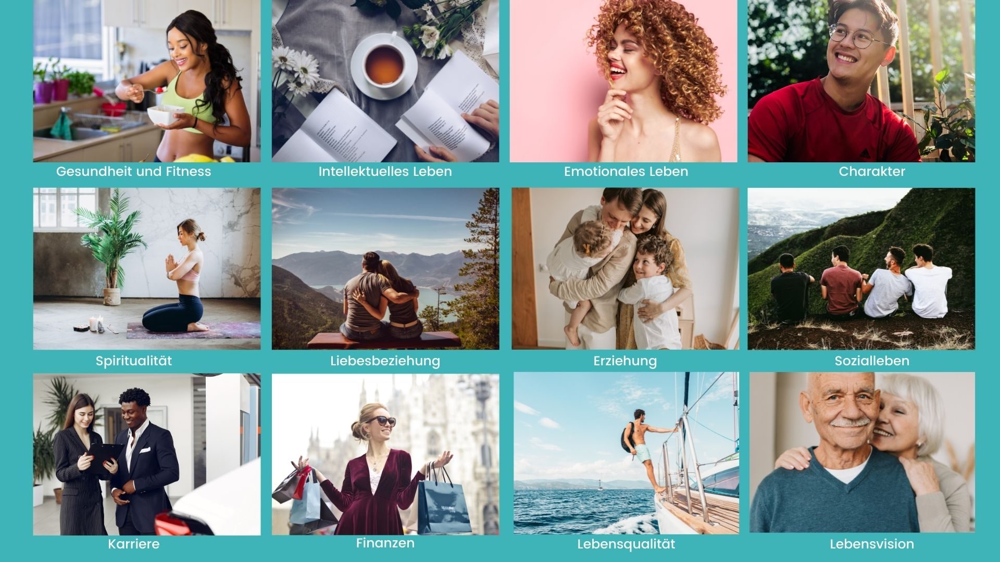
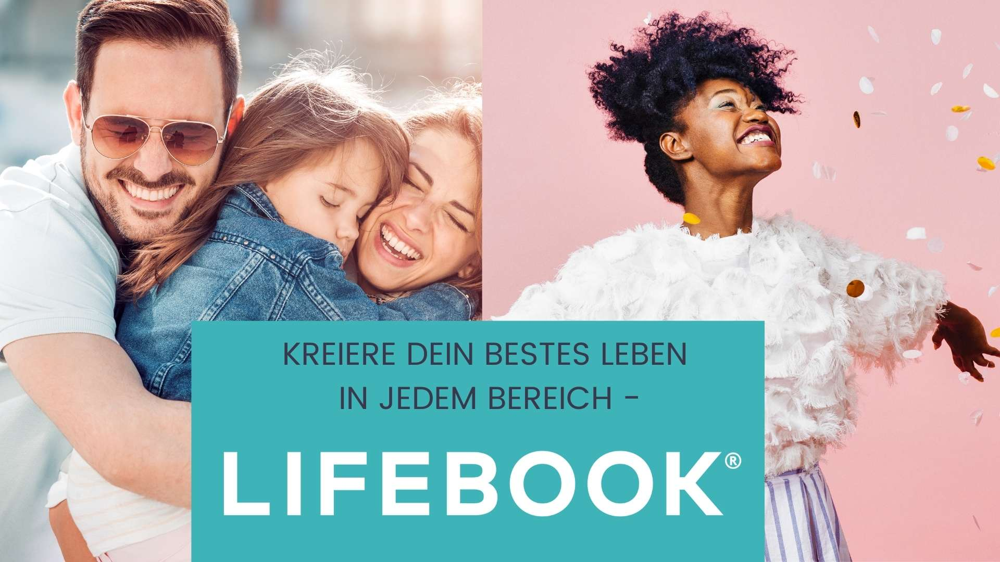

### Entwerfe ein Leben, das so erstaunlich ist, dass du es immer und immer wieder leben möchtest

**Hast du manchmal das Gefühl, dass dein Leben _nicht wirklich Dir gehört_ ?**

Es ist ein Gefühl, das du vielleicht inmitten eines anstrengenden Arbeitstages bekommst, wenn du statt Zeit mit deinen Liebsten zu verbringen einer Tätigkeit nachgehen musst, die dich nicht erfüllt. 

Oder wenn du ein Blick auf dein Bankkonto wirfst und es sich einfach nicht in einer Richtung entwickelt, in der du dich finanziell frei fühlst alles zu tun, was du dir wünschen würdest.

Vielleicht fühlst du es aber auch schleichend jedes Mal, wenn du in den Spiegel schaust und du dich zu müde, krank oder einfach nicht in Form fühlst, um dein Leben in vollen Zügen zu genießen.

Oder auch wenn du durch deinen Feed bei Instagram scrollst und du dich von den erstaunlichen Dingen, die andere mit ihrem Leben machen, so weit weg fühlst, als wäre dieses Leben einfach niemals erreichbar für dich.

**Wenn es dir wie mir vor noch einigen Jahren geht, dann steckst du wahrscheinlich in einer der blockierendsten Illusionen des menschlichen Daseins fest:**

_Die Illusion, dass das Leben deiner Träume nie mehr als ein Traum sein kann._

In diesem Zustand kann man leicht Jahre bis hin zu einem ganzem Leben damit verbringen, sich mit dem Zweitbesten zufrieden zu geben. Damit, dass die Erwartungen anderer die Richtung deines Lebens bestimmen, anstatt es bewusst selbst zu gestalten.

Diese Illusion endet in dem Moment, in dem du realisierst:

**Jedes außergewöhnliche Leben – ein Leben in grenzenloser Freude, Fülle, mit Sinn und Freiheit – beginnt mit einem Traum.**

Und es ist die Art von Traum, die jeder hat, egal wie „verrückt“ oder „unwahrscheinlich“ es erscheinen mag. Aber – und das ist der entscheidende Teil – dieser Traum brauch einen Rahmen, in dem er sich entfalten kann.

Er muss zu einer so genannten **Lebensvision** heranwachsen: einem ganz spezifischen und kristallklaren Plan, um die tiefsten Wünsche deiner Seele in deine Realität zu verwandeln.

Wenn du eine klare Lebensvision hast, musst du keinem deiner Träume jemals wieder hinterherlaufen...

Stattdessen wirst er erfahren, wie sich ein Leben anfühlt, in dem dich deine Träume verfolgen! In welchem du die Dinge magisch anzuziehen scheinst, die du dir schon immer sehnlichst gewünscht hast.

Durch diesen Prozess wirst du wieder entdecken, wer Du wirklich bist. Was Du wirklich willst. Und wozu du alles fähig bist. (Kleiner Ausblick: Es ist _viel_ mehr, als du dir jetzt überhaupt vorstellen kannst ;)! )

Das wirst du erleben, wenn du den entscheidenden Schritt gehst und dein eigenes **LIFEBOOK schreibst**. Denn mit diesem ganzheitlichen und fundierten Lifestyle-Designsystem, wirst du nicht nur deine Lebensvision manifestieren, sondern auch in jedem Bereich deines Lebens deine 10/10 erschaffen. 

Hast du eine Lebensvision, wirst du erleben, dass kein Traum zu groß und keine Wünsche zu unrealistisch sind.

### Werde der Autor deines besten Lebens

LIFEBOOK ist ein lebenstransformatives Manifestations-Tool, welches dich befähigt, DEIN bestes Leben zu SEHEN, zu PLANEN und zu ERREICHEN. Durch einen intuitiven Schritt-für-Schritt-Prozess wirst du entdecken, wer Du wirklich bist und was Du in allen 12 Dimensionen deines Lebens willst - und viel mehr noch! Mit deinem persönlichen Aktionsplan wirst du all diese wundervollen Dinge auch erreichen.

Während das LIFEBOOK Premium Coaching wirst du bei jedem Schritt zur Erstellung deines eigenen LIFEBOOKs von mir begleitet. **Du bist der Autor deines besten Lebens**. LIFEBOOK ist ein leeres System, welches DU mit deinen Antworten füllst - und dabei stehe ich dir als Coach zur Seite. 

Am Ende des LIFEBOOK-Prozesses wirst du ein bis zu 100-seitiges Buch besitzen, welches du erschaffen hast. Mit einer kristallklaren Vision von der Person, die du werden, und von dem Leben, das du leben willst - jenseits der von der Gesellschaft auferlegten Ziele.  
  
Jeder Traum, jeder Wunsch, jedes Ziel - alles, was du wirklich sein oder tun willst - ist auf den Seiten deines LIFEBOOK festgehalten. Du erschaffst dir deine Grundlage, um all deine Handlungen und Entscheidungen zu lenken, während du jeden Tag dein Traumleben voller Erfüllung, Freiheit, Wachstum und Freude kreierst.

### **Erreiche deine Vision von Erfolg in allen 12 Bereichen deines Lebens**

Die meisten Menschen konzentrieren sich nur darauf, ihre Karriere, ihren Reichtum, ihre Gesundheit und ihre Beziehungen zu verbessern - aber in Wirklichkeit gibt es viel mehr Lebensbereiche, die deinen Erfolg, dein Glück und deine wahre Erfüllung ausmachen.

LIFEBOOK nimmt dich mit auf einen augenöffnenden Schritt-für-Schritt Erkenntnisprozess, der es dir ermöglicht in ALLEN 12 Dimensionen deines Lebens deine persönliche 10 von 10 zu kreieren. Denn dabei geht es um DEIN Lebensglück - ohne Kompromisse einzugehen oder einen Bereich zugunsten eines anderen opfern zu müssen.

### Wie du das Leben gestaltest, von dem du träumst

Ich bin so glücklich und dankbar, dass ich als zertifizierter Lifebook Coach dieses unglaubliche Lifestyle-Design-System nach Deutschland bringen darf - und du kannst jetzt dabei sein!

Denn mit einer ausgewählten Gruppe werde ich zusammen ihr LIFEBOOK schreiben und sie dabei begleiten mit einem vollständigen und bewährten transformativen Lebensstilprogramm zum Autor ihres absolut besten Lebens zu werden.

**Ab Oktober 2021** werde ich eine limitierte Anzahl von Teilnehmern durch das neu gestaltete Lifebook-Premium-Programm führen, welches lebenslangen Zugang zum Lifebook-Online-Kurs, Coaching-Calls mit mir und sowie Q&A Calls mit den inspirierenden Gründern von Lifebook, Jon und Missy Butcher, beinhaltet.

<a href="https://www.subscribepage.com/lifebook" target="_blank">**Bewirb dich jetzt**</a> und werde der Autor deines besten Lebens - mit **LIFEBOOK**.

### Auf einen Blick: Wie sich dein Leben verändern wird

#### **Du wirst...**

* eine **kristallklare Vision** für dein Leben in allen 12 Lebensbereichen kreieren und herausfinden wie DEIN bestes Leben aussieht
* mit der Beantwortung von vier machtvolle Fragen herausfinden, wie du dein **außergewöhnliches Leben in allen Bereichen** erschaffst
* eine unerschütterliche **Widerstandsfähigkeit** entwickeln, denn du nutzt deine Zielklarheit und persönliche Kraft, um sämtliche Hindernisse zu überwinden - und dich angesichts herausfordernder Umstände und Übergänge wie Scheidung, Karrierewechsel, Gesundheitsprobleme und spiritueller Krisen sogar neu zu erfinden
* eine ganz neue **Work-Life-Balance** erreichen & in kürzerer Zeit viel mehr erledigen
* **jeden Traum, jeden Wunsch, jedes Ziel** - alles, was du wirklich sein oder tun willst - auf den Seiten deines persönlichen Lebensentwurfs festhalten. In deinem Lebensbuch.

### Sei dabei!

Dein LIFEBOOK gibt dir nicht nur die Freiheit, deine eigenen Regeln festzulegen und danach zu leben. Sondern auch die Klarheit und die Werkzeuge, um ein atemberaubendes Leben voller Authentizität, Erfüllung und ständigem Wachstum zu gestalten.

Kreiere dir jetzt dein Manifestations-Werk, welches dir aufzeigt, wer du wirklich bist, was Glück, Erfüllung und Erfolg für dich bedeutet und wie du deine Vision eines außergewöhnlichen Lebens verwirklichen wirst.

Wenn du bereit bist dein bestes Leben zu kreieren, dann <a href="https://www.subscribepage.com/lifebook" target="_blank">**bewirb dich jetzt!**</a>

Du verdienst alles, was du dir wünschst - gehe jetzt den entscheidenden Schritt und schreibe dein LIFEBOOK. Ich sehe dich in der nächsten LIFEBOOK Gruppe ♥

Liebe und Licht für dich,

deine Christin

***

_Namasté ♥_