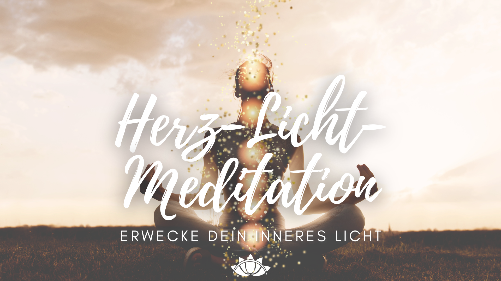
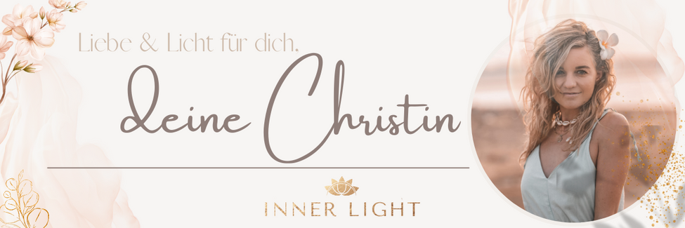

## Die Wintersonnenwende - ein entscheidendes Ereignis im Aufstiegsprozess des Planeten

Die Wintersonnenwende ist ein wahrhaft mystisches Ereignis, welches auf der Nordhalbkugel zwischen dem 20. und 23. Dezember, auf der Südhalbkugel zwischen dem 20. und 23. Juni stattfindet. Zur **Wintersonnenwende** hat die Erde auf ihrer Bahn um die Sonne den Punkt erreicht, ab dem sich die Nordhalbkugel wieder stärker der Sonne zuwendet. In diesem Jahr geschieht das am 21. Dezember um genau 16.58 Uhr.

Es ist eine ganz besondere Zeit, um zu **reflektieren**, Altes **ins Feuer zu geben** und schließlich das **Licht, Liebe und Fülle** in unser Leben einzuladen. Die Wintersonnenwende oder Julnacht ist die längste Nacht des Jahres und markiert einen Wendepunkt – die Wiedergeburt des Lichts – und leitet die Rauhnächte ein.

Die Wintersonnenwende ist eine Zeit der Besinnung und des Neubeginns. Genau wie bei der Sommersonnenwende sind wir eingeladen, einen Moment aus unserem **normalen Leben auszusteigen**, um still zu sein und uns mit dem **größeren Ganzen** unserer Reise zu verbinden. 

Zu dieser Zeit ruht die gesamte Natur - Samen und Zwiebeln verstecken sich vor dem kalten Wetter unter der Erde und viele Tiere halten Winterschlaf. Auch wir sind vom Universum eingeladen diese Zeit nutzen, um zu uns **Selbst zurück zu finden** und alles **loszulassen**, was wir nicht mit in diese neue Lebensphase und das neue Jahr nehmen wollen. Es ist von unschätzbarem Wert, wenn wir uns Zeiten des Rückzugs gönnen, die uns helfen, unseren Körper, unseren Geist und unsere Seele zu heilen und die zarten **Samen unserer eigenen Schöpfung** zu nähren.

### **Die Geschichte der Wintersonnenwende**

Die Wintersonnenwende ist auch unter dem Namen Yule bekannt und geht auf alte keltische Traditionen zurück. In der keltischen Mythologie war Yule die Zeit, in der die **Sonne geboren** und die **Dunkelheit der Winternacht vertrieben** wurde. Die Kelten feierten Yule mit Feuerzeremonien und dem Austausch von Geschenken, um die Rückkehr des Lichts zu feiern.

Heute wird die Wintersonnenwende von vielen Menschen auf der ganzen Welt als spirituelles Ereignis gefeiert. Viele nutzen diesen Tag, um ihre **Absichten und Wünsche** für das neue Jahr zu setzen, indem sie Kerzen anzünden oder eine Zeremonie abhalten. Andere nutzen die Wintersonnenwende, um **Dankbarkeit und Wertschätzung** für das vergangene Jahr auszudrücken und all das, was sie nicht mit ins neue Jahr nehmen wollen, dem **Feuer zu übergeben**. Ich liebe Rituale und habe schon so viel Magie in solchen Zeremonien erleben dürfen, dass ich auch in diesem Blogbeitrag zwei meiner **Lieblings-Rituale zur Wintersonnenwende** mit dir teilen werde. ♥

Die Wintersonnenwende ist vor allem auch ein **Fest der Wiedergeburt.** Ab diesem Zeitpunkt im Jahr werden die Tage länger und wärmer. Die Natur zeigt erste Anzeichen von Wachstum. Und auch wir beginnen, mehr **aus uns Selbst herauszugehen.** Auch wenn wir uns jetzt eher drinnen aufhalten, um uns warm zu halten und unsere Energie zu sparen, ist uns bewusst, dass die Sonne zurückkehrt und mit ihr neues Leben und neue Abenteuer. 

Die Wintersonnenwende ist traditionell eine Zeit des **Beisammenseins und der Verbundenheit**. Daher werden wir gemeinsam in unserem INNER LIGHT Soultribe für ein **_machtvolles Lichtaktivierung-Ritual_** zusammenkommen, um uns auf die Energie der Wintersonnenwende einzustimmen, die Lichtquotienten-Updates, die zu diesem besonderen Portaltag auf die Erde fließen, zu empfangen und die Magie der Rauhnächte zu eröffnen.

> **_Du willst bei diesem magischen Event dabei sein?_**  
> Dann spring **jetzt ins Licht** und sichere dir deinen Platz im <a href="https://elopage.com/s/innerlight/rauhnachts-challenge" target="_blank">**INNER LIGHT Rauhnachts-Retreat**</a>. Erlebe am **20. Dezember um 19 Uhr** eine machtvolle Lichtzeremonie, in welcher du deinen Lichtkörper aktivierst, um die tief kodierten, potenten Plasmastrahlen nutzen zu können und deinen Aufstiegsprozess zu beschleunigen.

> **_Du willst auch in 2023 mit allen Portaltagen und Mondphasen verbunden sein? Dann schenke dir jetzt den_** <a href="https://www.etsy.com/de/listing/938608828/2023-mondkalender-mit-portaltagen" target="_blank">**INNER LIGHT Mondkalender mit allen Portaltagen und Sternzeichen!**</a>

### **Warum die Wintersonnenwende 2022 ein herausragendes kosmisches Ereignis ist**

Die Erde durchläuft im Moment eine tiefgreifende und einzigartige Transformation. Wenn du gerade diese Worte liest, dann deshalb, weil du bereit bist dieses kosmische Wissen in dir zu aktivieren. 

Unser Planet steigt zu höheren Frequenzen auf, um zu einem neuen 5D Zuhause zu werden. Und zu diesem Zweck empfängt die Erde **_stark kodierte und hochwirksame Plasmastrahlen_**, die über verschiedene Lichtportale auf die Erde fließen. Wir nennen diese Strahlen photonisches Licht. Diese Plasmastrahlen kommen von der großen Zentralsonne, der Atmosphäre und dem kristallinen Kern der Erde. 

Mit der Wintersonnenwende 2022 werden erstmalig von einer Intensität sein, die wir noch nie zuvor gespürt haben. Diese Plasmastrahlen sind mit **Lichtcodes** ausgestattet, d.h. mit Informationen, die universelle Weisheit, Intelligenz und Liebe enthalten und darauf abzielen, unsere Zellen, unsere DNA und alle Schichten unseres Seins zu verändern und zu erwecken. Nicht nur die Erde, sondern auch jedes Lebewesen auf diesem Planeten, durchläuft gerade einen **tiefgreifenden Prozess des Aufstiegs.**

> _Der Aufstieg ist ein Prozess der Bewusstseinserweiterung in höhere Schwingungsfrequenzen. Es ist die Erschaffung des Himmels auf Erden durch eine tiefe Verbindung zum Leben, das keinen Mangel, keine Trennung oder Begrenzung kennt._

Wenn wir alte Traumata, niedrig schwingende Emotionen wie Angst, Scham, Schuld, einschränkende Glaubenssätze, die wir im Laufe unseres Lebens erworben haben, sowie die Energien unserer Vorfahren und vergangener Leben **transformieren und loslassen**, beginnen wir unsere Schwingung zu erhöhen und unser Bewusstsein zu erweitern.

### **Was verändert sich mit der Wintersonnenwende 2022?**

Mit den geöffneten Lichtportalen wird es uns leichter fallen jene Gedanken, Emotionen und Glaubenssätze zu erkennen, die **nicht unserem wahren Selbst** entsprechen. Das Licht wirkt wie eine Bewusstseinserweiterung - wir können mehr von dem sehen, was wahrhaftig ist. Je mehr wir in der Lage sind, dieses Licht zu empfangen und zu speichern, können wir auch unsere unterbewussten Glaubenssätze **mit den richtigen Tools** verändern und uns auf höhere Frequenzen wie bedingungslose Liebe, Seins-Freude und Mitgefühl einschwingen. Wir beginnen, uns mit unserer wahren Essenz zu verbinden, mit unserem Höheren Selbst, wir beginnen, uns in den Prozess zu verlieben, voll und ganz zu sein, wer wir wirklich sind, und zu erfahren, wozu wir in diesem Leben fähig sind.

Aber auch in unserem **Körper** geschehen Veränderungen, denn unsere Zellen beginnen, die Fähigkeit zu verstärken, Licht zu empfangen und zu halten. Dieser Prozess erfordert eine **Aktivierung deines Lichtkörpers**, welche wir in der **Lichtzeremonie am 20. Dezember um 19 Uhr im Rahmen des** <a href="https://elopage.com/s/innerlight/rauhnachts-challenge" target="_blank">**INNER LIGHT Rauhnachts-Retreat**</a> gemeinsam einleiten werden. 

Sobald dein Körper in der Lage ist auf höheren Frequenzen zu schwingen, wirst du in der Lage sein, diese Lichtcodes zu empfangen und deine DNA zu upgraden. Dies ist jedoch bei den meisten Menschen, die jetzt auf diesem Planeten leben, bisher noch nicht der Fall, weshalb es so entscheidend ist, dass **DU zu den Lichtträgern** wirst, die den Aufstiegsprozess ermöglichen.

  
Es braucht eine Weile, bis sich der Körper an diese höheren Schwingungen gewöhnt hat, und je nach Grad des Widerstandes und der Identifikation mit alten Glaubenssätzen und Ängsten, können wir emotionale, mentale, spirituelle oder körperliche Symptome verspüren. Diese Symptome werden **Aufstiegssymptome** genannt.

### **Welche Rituale du für die Wintersonnenwende nutzen kannst**

Die Ankunft des Lichts und die Veränderungen, die wir von nun an immer stärker auf individueller, aber auch auf kollektiver, Ebene spüren können, sind definitiv ein Grund zum Feiern! Wie schon angedeutet, LIEBE ich es, die Energien solch machtvoller Portaltage zu nutzen - für meinen eigenen Seelenweg, aber auch in meiner Verantwortung als Lichtbringerin für Mutter Erde und die Menschheit.   
  
Du bist auch einer dieser außerwählten Seelen my love, nicht wahr? Dann solltest du UNBEDINGT bei der <a href="https://elopage.com/s/innerlight/rauhnachts-challenge" target="_blank">**INNER LIGHT LICHTZEREMONIE am 20. Dezember um 19 Uhr**</a> dabei sein. Es wird so magisch!  
  
Um die Wintersonnenwende herum, kannst du außerdem diese zwei Rituale nutzen, um das besondere kosmische Ereignis feiern und die Energien für dich nutzen.

### (1) RITUAL DES HEILIGEN YULE-HOLZ

**_Für dieses Ritual brauchst du:_**

* einen Ort, an dem du deinen Altar aufstellen kannst 
* ein Stück Holz, welches du verbrennst (wenn du kannst, mache einen Spaziergang in der Natur, um dein passendes Holz dafür zu finden)
* etwas, worauf du deine Intentionen und Wünsche schreiben kannst, z. B. Papierstreifen oder Kartenanhänger
* etwas, mit dem du diese an deinem heiligen Stück Holz befestigen kannst
* einen Stift
* Dinge, mit denen du dein heiliges Holz schmücken kannst, z. B. Bänder, Blumen oder jegliche Art von Kunst und Bastelmaterial, das für dich eine Bedeutung haben

### WIE DU DEIN HEILIGES YULE-HOLZ KREIERST

1. Mach eine **Wanderung in der Natur** mit der Intention dein heiliges Stück Holz (Yule-Holz) sowie die anderen Elemente für das oben erwähnte Ritual zu finden.
2. Öffne für dich deinen **heiligen Raum** auf die Art und Weise, wie es sich für dich bedeutungsvoll und stimmig anfühlt. (Du kannst z.B. räuchern, eine Kerze anzünden, Klang-Frequenzen anmachen oder meditieren, um dich mit dir und deinem heiligen Raum zu verbinden)
3. Nimm dir etwas Zeit, um zu den folgenden Fragen deine Impulse und Gedanken in dein **Journal** zu schreiben:
   * _Was hast du in diesem Jahr erreicht, worauf du besonders stolz bist?_
   * _Wofür bist du in deinem Leben gerade am meisten dankbar?_
   * _Was darf gerade in dir erwachen?_
   * _Was darf gehen?_
   * _Was möchtest du im neuen Jahr mehr in dein Leben einladen?_
4. Schreibe deine **Intentionen und Wünsche für das neue Jahr** auf die Papierstreifen oder Kartenanhänger
5. Befestige diese an deinem heiligen Yule-Holz. Folge einfach deiner Intuition und lass deiner **Kreativität** freien Lauf. Denkt daran - Schöpfung, Liebe und Kreativität sind Tore zu deiner Seele.
6. Bereite einen **sicheren, ungefährlichen Ort** vor, an dem du dein Yule-Holz verbrennen kannst.
7. Übergib dein Yule-Holz dem Feuer, und während er brennt, übergib deine Intentionen und Wünsche dem Universum und **bedanke dich dafür,** dass all das was du dir wünschst, zum besten von dir und allem was ist geschehen möge. Spüre die Wärme des Feuers und visualisiere, wie es die **Wiedergeburt des Lichts** in dir und auf Mutter Erde verkörpert.
8. Während du die Flammen tanzen siehst, denke darüber nach, was **in dir aufsteigt** und was bereit ist, **von dir abzufallen.**
9. Stelle sicher, dass die Flammen **sicher gelöscht sind** und **schließe deinen heiligen Raum** auf die Art und Weise, wie es sich für dich stimmig anfühlt.

### (2) Herz-Licht-Reise

**_Für dieses Meditations-Ritual brauchst du:_**

* einen ruhigen Ort, an dem du ungestört bist
* dein Journal oder Tagebuch sowie eine Stift
* eine Kerze in der Farbe deiner Wahl und etwas zum Anzünden 
* eine Decke oder einen Yoga-Block, um beim Meditieren etwas erhöht zu sitzen, wenn es dir damit leichter fällt deine Wirbelsäule gerade zu halten
* Räucherwerk deiner Wahl (das kann eine Räuchermischung sein, bestimmte getrocknete Kräuter, Palo Santo oder Räucherstäbchen) 
* Kopfhörer, wenn du diese Herz-Licht-Reise als   <a href="https://youtu.be/nJrP1x-xSGw" target="_blank">**geführte Meditation**</a> mit mir zusammen machen möchtest ♥

**1. Öffne deinen heiligen Raum**

Richte dir deinen Platz so her, dass du dich wohlfühlst und einige Zeit ungestört bist. Wenn du magst, mache dir ein warmes Getränk und lege schöne Musik auf. Bevor du beginnst, kannst du noch einmal die Fenster öffnen, sodass der Raum mit frischer Lebensenergie durchströmt wird.

Dann zünde deine Kerze an mit der Intention, dass du jetzt deinen heiligen Raum eröffnest.

Nimm dein Journal oder Tagebuch zur Hand und lass all deine Gedanken fließen, die sich jetzt gerade zeigen. **Fragen, die du dir stellen kannst:**

* Was macht mein Herz schwer?
* Wo erlaube ich mir nicht mein Licht hell erstrahlen zu lassen?
* Was bin ich bereit loszulassen?
* Was will ich stattdessen in mein Leben einladen?

**2. Reinige dein Energiefeld**

Nimm dein Räucherwerk und reinige dein **Energiefeld** mit der Intention, den Herz von allem zu befreien, was nicht mit deinem wahren Selbst im Einklang ist und was dein Inneres Licht dimmt. 

Visualisiere wie der Rauch **jegliche Negativität und niedrige Schwingungen** einschließt und für dich zu den höchsten Frequenzen transformiert.

**3. Meditation "Herz-Licht-Reise"**

Nimm für die Meditation jetzt eine entspannte, aufrechte Sitzposition ein. Sitze gern etwas erhöht auf einer Decke oder einem Yoga-Block, wenn es dir damit leichter fällt deine Wirbelsäule gerade zu halten. Lege deine Hände mit den Handinnenflächen nach oben entspannt auf deinen Oberschenkeln oder in deinem Schoß ab. Wenn du deinen Sitz gewählt hast, dann schließe liebevoll deine Augen und nimm einen tiefen Atemzug.

Dann beginne in dem folgendem **Atemzyklus** zu atmen und folge der Visualisierung so lange wie es sich für dich gut anfühlt:

* Atme tief durch deine Nase ein, bis in deinen Brustkorb und spüre wie dein Atem dein **inneres Licht** berührt. 
* Halte die Luft in deinem **Herz-Raum** und fühle wie das Licht stärker wird, wie du ihm deine Aufmerksamkeit schenkst. 
* Atme langsam über deine Nase aus und wie du ausatmest, **verbreitet sich dein inneres Licht** von deinem Herz-Raum bis in deinen gesamten Körper. 
* Bleibe kurz in der **Atemstille** und spüre das Licht durch deinen Körper fließen. 

  Wiederhole das einige Male in deinem Tempo, bis sich erst dein ganzer Körper in dem Licht erstrahlt, dann deine Aura, dann der Raum, in dem du bist, und schließlich wie dieses strahlende Licht die ganze Erde umschließt

Bleibe solange es sich für dich stimmig anfühlt in diesem tief-verbundenem Gefühl mit deinem Herzen und erfüllt und umgeben von deinem Inneren Licht. Du kannst ein **Mantra** nutzen, um deine Gedanken immer wieder in den gegenwärtigen Moment zu bringen: _Ich bin genug. Ich bin Liebe. Ich bin Licht._

> #### **_Du kannst diese Herz-Licht-Reise auch als_** <a href="https://youtu.be/nJrP1x-xSGw" target="_blank">**geführte Meditation**</a>**_mit mir zusammen machen ♥_**

##### Dies ist ein Blogbeitrag aus einer mehrteiligen Serie über seelenreinigende Jahresend-Rituale. Wenn du mehr über den Abschluss des vergangenen und Beginn des neuen Jahres erfahren möchtest, dann schau gern auch bei <a href="https://innerlight-hypnotherapy.com/dunkelnaechte" target="_blank">**"Die Magie der Dunkelnächte"**</a> vorbei!

Genieße die Magie der Wintersonnenwende und das wundervolle Gefühl nach diesen Ritualen. You deserve to be free ♥

##### Ich freue mich sehr für dich, dass du bereit bist dich von allem zu lösen, was dir nicht mehr dient, um dein wahres Selbst heller und heller scheinen zu lassen. Danke, dass es dich gibt, du wundervolle Seele! _Namasté_

***